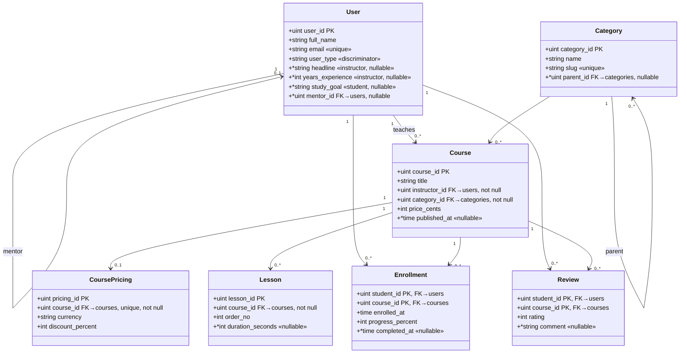

# แบบฝึกสอบปฏิบัติ (ระดับยาก): Relational Mapping ด้วย GORM — LearnHub (แพลตฟอร์มคอร์สออนไลน์)

รูปแบบเดียวกับข้อสอบจริง: Starter Source Code ให้ครบ นักศึกษาเขียนเฉพาะ **`internal/models/`**
ให้ตรงกับ **Class Diagram + Business Rules** ด้านล่าง แล้วรัน Test / เปิด `learnhub.db` ด้วย **SQLite Viewer**

> **ไม่มีคำใบ้ (TODO) ในไฟล์โมเดล** — ต้องวิเคราะห์เอง 100% จาก diagram + rules
> จุดที่ต้องแก้กระจายอยู่ ~9 หัวข้อ (17 จุดย่อย) ใน 7 ไฟล์

---

## 1. Business Rules

### 1.1 ผู้ใช้ (User) — Single Table Inheritance
- ผู้ใช้ทุกคนอยู่ในตาราง `users` ตารางเดียว แยกบทบาทด้วยคอลัมน์ `user_type` (`"instructor"` / `"student"`)
- ข้อมูลกลาง: `full_name`, `email` — **อีเมลห้ามซ้ำ**
- ข้อมูลเฉพาะ **instructor**: `headline`, `years_experience`
- ข้อมูลเฉพาะ **student**: `study_goal`
- ข้อมูลเฉพาะบทบาทต้อง **ว่าง (NULL) ได้** เมื่อบันทึกผู้ใช้อีกบทบาทหนึ่ง
- ผู้ใช้แต่ละคน **อาจมี "mentor" เป็นผู้ใช้อีกคนหนึ่งหรือไม่มีก็ได้** (ความสัมพันธ์อ้างอิงตัวเอง)

### 1.2 หมวดหมู่ (Category) — โครงสร้างลำดับชั้น
- `name` = ชื่อที่แสดง, `slug` = ตัวระบุสำหรับ URL **ห้ามซ้ำ**
- แต่ละหมวดหมู่ **อาจมีหมวดหมู่แม่ (parent) หรือเป็นหมวดระดับบนสุด (ไม่มี parent) ก็ได้** — อ้างอิงตัวเอง

### 1.3 คอร์ส (Course)
- คอร์สทุกคอร์ส **ต้องมีผู้สอน 1 คน** (instructor — เป็น User) และ **ต้องสังกัด 1 หมวดหมู่** เสมอ
- ผู้สอน 1 คนสอนได้หลายคอร์ส, หมวดหมู่ 1 อันมีได้หลายคอร์ส (1:N ทั้งคู่ โดย Course ถือ FK)
- `published_at` = วันที่เผยแพร่ — คอร์สที่ยังเป็น **ฉบับร่าง (draft) ยังไม่มีวันเผยแพร่ (NULL)**

### 1.4 ราคาโปรโมชัน (CoursePricing)
- คอร์ส 1 คอร์ส **มีข้อมูลราคาโปรโมชันได้ไม่เกิน 1 ชุด หรือไม่มีเลยก็ได้** (1:1 optional)
- ต้องกันไม่ให้มี pricing ซ้ำต่อ 1 คอร์ส

### 1.5 บทเรียน (Lesson)
- คอร์ส 1 คอร์สมีหลายบทเรียน (1:N — Lesson ถือ FK)
- `order_no` = ลำดับบทในคอร์ส — **ลำดับห้ามซ้ำกันภายในคอร์สเดียวกัน** (คอร์สอื่นใช้เลขลำดับซ้ำได้)
- `duration_seconds` = ความยาววิดีโอ **ไม่บังคับ (NULL ได้)**

### 1.6 การลงทะเบียนเรียน (Enrollment)
- นักเรียน 1 คนลงได้หลายคอร์ส และคอร์ส 1 คอร์สมีนักเรียนได้หลายคน (M:N)
- ใช้ตารางเชื่อม เก็บ `enrolled_at`, `progress_percent`
- **นักเรียนคนเดิมลงทะเบียนคอร์สเดิมซ้ำไม่ได้** → ใช้ `(student_id, course_id)` เป็น **Composite Primary Key**
- `completed_at` = วันที่เรียนจบ — **ยังเรียนไม่จบ = NULL**

### 1.7 รีวิว (Review)
- นักเรียนรีวิวคอร์สที่เรียน (M:N ผ่านตารางเชื่อม) เก็บ `rating`, `comment`
- **รีวิวได้คอร์สละ 1 ครั้งต่อนักเรียน 1 คน** → `(student_id, course_id)` เป็น **Composite Primary Key**
- `comment` = ข้อความ **ไม่บังคับ** (กดให้ดาวเฉย ๆ ได้)

---

## 2. Class Diagram



---

## 3. วิธีทำ

```bash
go test ./tests/... -v -count=1     # ตอนเริ่มจะ FAIL ทั้ง 7 ชุด
# ... แก้ internal/models/ จน PASS ทั้งหมด ...
go run ./cmd/server                 # สร้าง learnhub.db
```

เปิด `learnhub.db` ด้วย **SQLite Viewer** ตรวจให้ตรง diagram:
- PK เดี่ยว vs **Composite PK** (`enrollments`, `reviews`)
- **UNIQUE index** (`users.email`, `categories.slug`, `course_pricings.course_id`, และ composite `lessons(course_id, order_no)`)
- **FOREIGN KEY** ทุกเส้น รวม self-reference (`users.mentor_id`, `categories.parent_id`)
- คอลัมน์ที่ต้องเป็น **NULL ได้** (subtype fields, `published_at`, `completed_at`, `comment`, `duration_seconds`)

## 4. เฉลย

`SOLUTION.md` + `SOLUTION/models/` — ลองทำเองให้สุดก่อน
