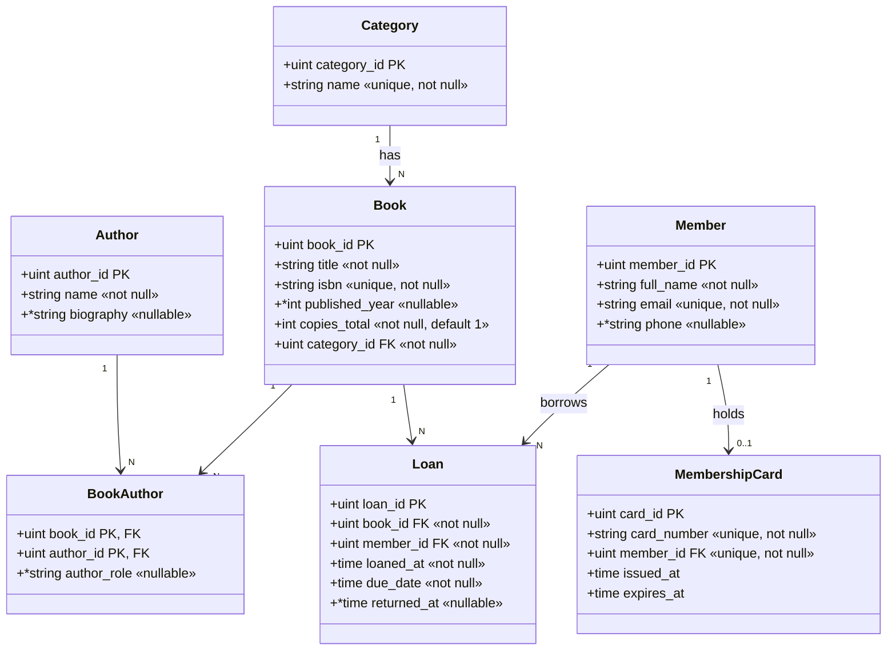

# แบบฝึกสอบปฏิบัติ: Relational Mapping ด้วย GORM — ระบบห้องสมุด (Library System)

โจทย์จำลองสำหรับซ้อมก่อนสอบ ระดับ **ง่าย–กลาง** รูปแบบเดียวกับข้อสอบจริง:
มี Starter Source Code ให้ครบ นักศึกษาเขียนเฉพาะ **`internal/models/`** ให้ตรงกับ
Class Diagram + Requirements แล้วรัน Test / เปิด `library.db` ด้วย **SQLite Viewer** ตรวจ

---

## 1. สถานการณ์ (Requirements)

1. **สมาชิก (Member)** — เก็บชื่อ, อีเมล, เบอร์โทร
   - อีเมลใช้ติดต่อและระบุตัวตน **ห้ามซ้ำ**
   - เบอร์โทร **ไม่บังคับ** (สมาชิกบางคนไม่ให้ไว้ = NULL)

2. **หมวดหมู่ (Category)** — ชื่อหมวดหมู่ **ห้ามซ้ำ** และ **ห้ามว่าง**

3. **หนังสือ (Book)**
   - มี ISBN เป็นรหัสสากล **ห้ามซ้ำ**
   - `published_year` **ไม่บังคับ** (หนังสือเก่าบางเล่มไม่ทราบปีพิมพ์ = NULL)
   - หนังสือ **ทุกเล่มต้องสังกัด 1 หมวดหมู่** (Category 1 : N Book — Book ถือ FK)

4. **ผู้แต่ง (Author)** — ไฟล์ `author.go` เขียนถูกให้แล้ว ใช้อ้างอิงวิธีเขียน tag

5. **ความสัมพันธ์หนังสือ–ผู้แต่ง (M : N)**
   - หนังสือ 1 เล่มมีผู้แต่งได้หลายคน / ผู้แต่ง 1 คนมีได้หลายเล่ม
   - ใช้ตารางเชื่อม **`BookAuthor`**
   - **ห้ามบันทึกผู้แต่งคนเดิมซ้ำในหนังสือเล่มเดียวกัน** → `(book_id, author_id)` เป็น **Composite Primary Key**

6. **การยืม (Loan)** — ยืมหนังสือ 1 เล่ม โดยสมาชิก 1 คน ต่อ 1 รายการ
   - Member 1 : N Loan และ Book 1 : N Loan → **Loan เป็นฝั่งถือ FK ทั้ง `book_id` และ `member_id`**
   - `returned_at` **เป็น NULL ได้** (ถ้ายังไม่คืน)

7. **บัตรสมาชิก (MembershipCard)** — สมาชิก 1 คนมีบัตรได้ **ไม่เกิน 1 ใบ** (1 : 1 optional)
   - ต้องบังคับ `member_id` **ไม่ให้ซ้ำ** (uniqueIndex)

---

## 2. Class Diagram



---

## 3. วิธีทำ

```bash
# 1) รันเทสต์ (ไม่ต้องมี DB) — ตอนเริ่มจะ FAIL หลายข้อ
go test ./tests/... -v -count=1

# 2) แก้ไฟล์ใน internal/models/ ตาม TODO จนเทสต์ผ่านหมด (PASS)

# 3) สร้าง/ตรวจฐานข้อมูลจริง
go run ./cmd/server         # สร้างไฟล์ library.db

# 4) เปิด library.db ด้วย SQLite Viewer ใน VS Code
#    - ตรวจชื่อคอลัมน์ / type / NOT NULL / PRIMARY KEY
#    - ตรวจ FOREIGN KEY และ UNIQUE ของแต่ละตาราง
```

> มี TODO ให้แก้ทั้งหมดประมาณ **8 หัวข้อ (12 จุดย่อย)** กระจายใน 6 ไฟล์
> (`category.go`, `member.go`, `book.go`, `book_author.go`, `loan.go`, `membership_card.go`)

## 4. เฉลย

ดูโฟลเดอร์ `SOLUTION/` — ลองทำเองให้สุดก่อนเปิด
